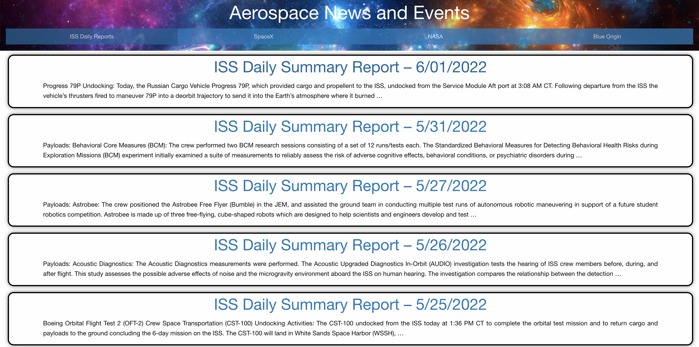

<h3>User Story:</h3>

AS A Space Enthusiast
I WANT a website that can give me recent news and space events information

<h3>Technical Tools:</h3>

HTML

CSS

Foundation (CSS API / Library)

JavaScript

API: https://ll.thespacedevs.com/

API: https://api.spaceflightnewsapi.net/

<h3>Requirements:</h3> 

Use a CSS framework other than Bootstrap.

Be deployed to GitHub Pages.

Be interactive (i.e: accept and respond to user input).

Use at least two server-side APIs.

Does not use alerts, confirms, or prompts (use modals).

Use client-side storage to store persistent data.

Be responsive.

Have a polished UI.

Have a clean repository that meets quality coding standards (file structure, naming conventions, follows best practices for class/id-naming conventions, indentation, quality comments, etc.).

Have a quality README (with unique name, description, technologies used, screenshot, and link to deployed application).

<h3>Current State:</h3>

